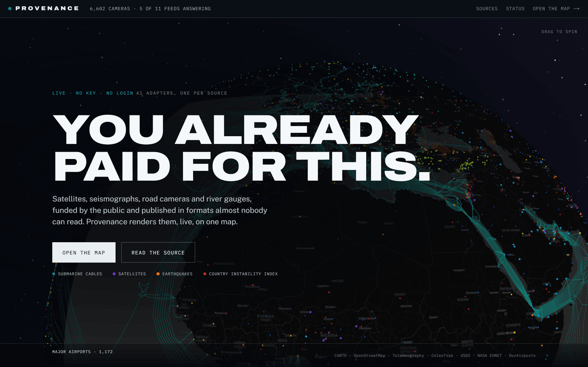
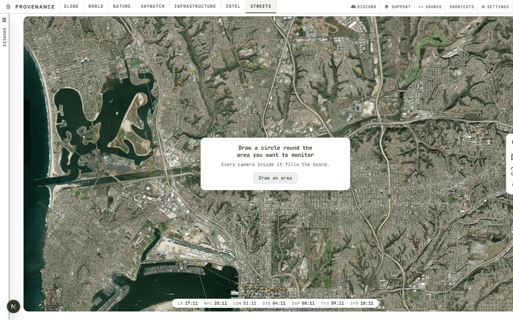
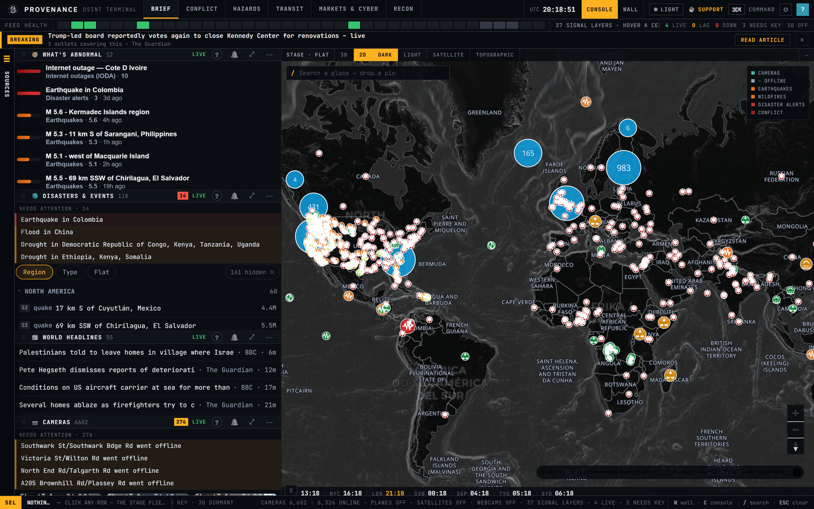
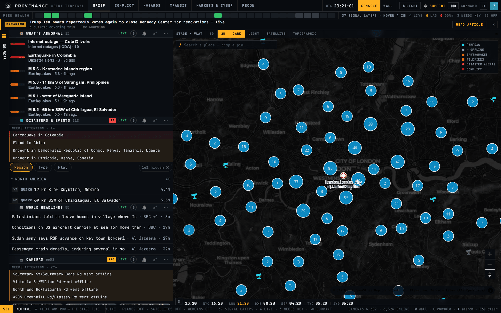
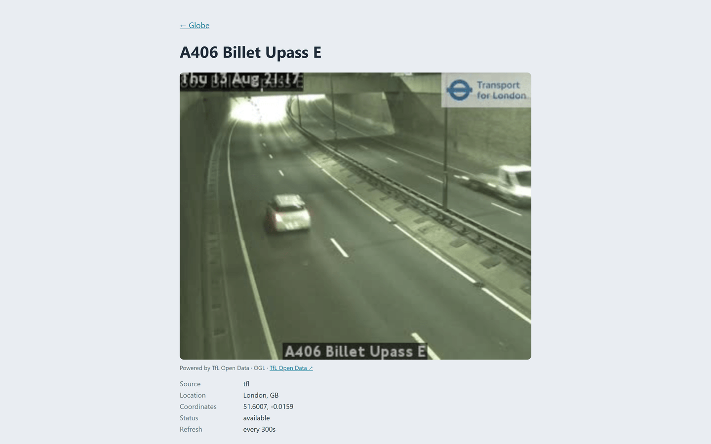
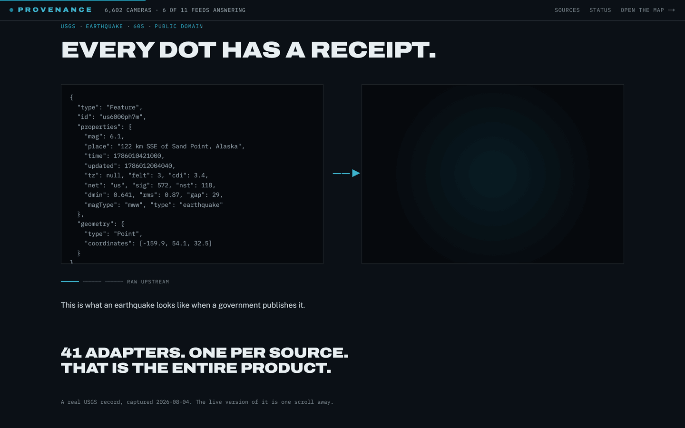

<p align="center">
  
</p>

<h1 align="center">Provenance</h1>
<p align="center">A live map of the world's open data, where every dot says who published it and how it knows.</p>

<p align="center">
  <a href="https://provenance-online.vercel.app"></a>
  <a href="LICENSE"></a>
  
  
  
  
</p>

Governments, space agencies, seismologists and UN clusters publish an enormous amount of live data for free, in formats almost nobody can read. Provenance renders **41 live layers on one globe**: government road cameras, aircraft, satellites, earthquakes, wildfires, undersea cables, national internet shutdowns, conflict, displacement, markets and news. Every layer carries the body that published it, how its numbers were arrived at, and what it *cannot* tell you. The core map takes no key and no login.

The repository used to be called `TrafficNerd-V2` and the product was briefly called OpenData. Both are now **Provenance**. It is the web rewrite of [TrafficNerd v1](https://github.com/011-sam-110/TrafficNerd), which was a London-only terminal app.

_Status: live at [provenance-online.vercel.app](https://provenance-online.vercel.app) and runs locally with no keys. Coverage is real but partial and depends on public upstreams staying open, so here is what production actually returned on **2026-08-18**, against `6f60b4a`:_

| Check | Result |
|---|---|
| all 37 `GET /api/signals/<id>` | **37 of 37 answered `200`** - 34 returned data, 3 were empty |
| `GET /api/coverage` | **12,866 to 13,266 cameras** across four spaced reads, all 14 feeds answering |
| `GET /api/planes` | **3,000 aircraft**, declared as a cap on the 5,306 seen, itself a declared lower bound |
| `GET /api/satellites` | 157 satellites |
| `GET /api/webcams` | 1,623 webcams |
| `npx vitest run` | **2,212 tests across 256 files**, all passing |

The three empty layers were ACLED (the free account's API read access is not activated yet), ReliefWeb and ENTSO-E grid load (each waiting on a free key). All three still answered `200` with an empty set, which is the contract: a dormant upstream degrades to an honest blank, never a 5xx and never invented data. AIS ships was a fourth empty layer when this table was last taken and is now returning vessels.

**Why the camera count is a range and not a number.** Four reads of `/api/coverage` spaced 70 s apart returned 12,866, 13,066, 13,266 and 12,866. The feeds are not moving that fast. The camera registry holds its cache and its last-good map in module-level state, so every serverless instance keeps its own copy and each request is answered by whichever instance the router happens to pick. Two different totals inside a window shorter than the five-minute refresh TTL settle it, because one instance cannot change its own answer that fast. So a single read samples a pool rather than a moment on a time series, and a total quoted without that context is a figure nobody can reproduce. Readings near 19,200 have also been seen today, and they are higher precisely because a feed had just failed and its larger last-good set was being retained: the most impressive number is the least trustworthy one.

**Open issue, stated plainly.** The camera total is short of what its feeds should add up to, and the Castle Rock 511 adapter is where the gap is: it fans out to nine US and Canadian 511 systems and has been observed answering about 6,200 to 6,600 cameras against the roughly 17,000 those systems hold. An earlier version of this paragraph blamed the deployment's egress being refused and called it undiagnosed. That was wrong, and correcting it is more useful than deleting it. The cause was our own code: a uniform 10-second per-feed timeout in `lib/sources/registry.ts`, applied to an adapter that needs ~18.5 s warm and ~40 s cold across ~143 paginated requests. It lost that race on every refresh, so it was missing from production entirely, not intermittently but structurally, and running it directly always succeeded, which is exactly what made a refused-egress theory look right. Giving the feed its own 60 s budget fixed the deletion. It did not recover the missing two thirds, and whether ~6,300 is the adapter's genuine current size or a continuing shortfall cannot be settled by reading the endpoint from outside, for the pooling reason above. That one needs instrumentation inside the adapter. Two smaller gaps: `ships` and `weather` are disabled "soon" rows in the core layer rail (both ship as *signal* layers, so those rail entries are a separate, unbuilt basemap treatment), and best-accuracy photo geolocation wants a local GeoCLIP sidecar, without which `/locate` falls back to a vision-model estimate.

Every figure above will drift, which is why each one is dated and pinned to a commit rather than left floating. `CLAUDE.md` holds the command to re-measure each one, and [`docs/API_KEYS.md`](docs/API_KEYS.md) holds the canonical env-var names.

## ✨ Features

- **One continuous globe-to-map engine** - a single MapLibre `projection: 'globe'` instance morphs a spinning satellite Earth into a flat satellite, light or topographic map as you zoom. No cross-fade seam, one WebGL context. 3D mode calls `map.setTerrain()` against AWS `terrarium` raster-DEM tiles, engaging at zoom 6 where the globe projection hands over to mercator.
- **41 layers, each independently attributed** - four core layers (cameras, webcams, aircraft, satellites) plus 37 global-signal layers, each opt-in and drawn as its own hazard pin: a composite Country Instability Index, earthquakes (USGS and EMSC), wildfires, volcanoes, storms and floods (NASA EONET), GDACS disaster alerts, tropical cyclones, NASA FIRMS active fires, aurora and space weather (NOAA), rocket launches, undersea cables and their landing stations, GPS jamming, nuclear plants, airports, ports, national internet outages (IODA), FAA airspace status, cloud-provider outages, GDELT conflict and protests, ACLED events, weather and air quality (Open-Meteo plus OpenAQ stations), UK street crime, cyber command-and-control and ransomware (abuse.ch, Ransomware.live), forced displacement (UNHCR), food security (WFP), ReliefWeb emergencies, ENTSO-E grid load, military ADS-B and AIS ships.
- **Every layer says how it knows** - each of the 37 carries a provenance card: what a single pin actually *is*, the method behind it, a confidence class (today 11 official, 10 reported, 7 measured, 7 modelled, 2 derived) and a limitation that is never allowed to be empty. There is no "not documented yet" fallback, because `tests/unit/signals-explain.test.ts` fails the build when a layer is registered without one.
- **Truncation is declared, not hidden** - an endpoint that caps its response says so in a coverage record: how many rows existed upstream, how many are here, and how the survivors were chosen. Active fires returned 1,500 of 23,185 that way, UK crime 1,500 of 10,504, aircraft 3,000 of 5,306 and GPS jamming 400 of 546.
- **17 camera feeds, 25 agency networks, 11 countries, keyless** - the actual agency feeds (TfL, Caltrans, SCDOT, Finland Digitraffic, Castle Rock 511, Oregon TripCheck, DriveBC, NZTA, Iceland, Estonia, Traffic Scotland, CET-SP Sao Paulo, two Serbian operators - MUP border crossings and JP Putevi Srbije toll plazas - BIHAMK in Bosnia and Herzegovina, ACT in Puerto Rico, and Houston TranStar, the first network added by discovery rather than by hand). Feeds and networks are not the same count here, because Castle Rock alone carries nine separate 511 deployments (Florida, Georgia, New York, Idaho, New England, Ontario, Alberta, Nova Scotia, New Brunswick), which is what takes 17 feeds to 25 agencies. All of it is normalised into one `Camera` shape and clustered natively by MapLibre rather than in a client-side loop. Each camera opens its live still or HLS video through a closed proxy that takes a camera **id**, never an arbitrary URL, resolves it behind a host allowlist and caches at that source's own cadence. A feed that fails keeps its last-good cameras instead of silently deleting its region.
- **Aircraft and satellites** - live ADS-B from OpenSky's global snapshot with an adsb.lol grid sweep as fallback, breadcrumb trails and route enrichment fetched on click; satellites propagated in the browser from CelesTrak TLEs with SGP4, so the server never ticks orbits and the constellation moves at frame rate.
- **A terminal-style console** - a dense OSINT shell at `/app`: 70 widget types in a ⌘K catalogue, seven boards that rearrange the workspace and re-skin the map layers in one tap, 13 monitor variants, a drag-and-snap widget grid, and any layout shareable as a `?c=` URL. Countries are clickable for a sourced dossier (UK FCDO travel advice, the instability index with each contributing layer linked, and the signals active there), and every widget dumps its visible rows as CSV or GeoJSON.
- **A landing page that cannot drift** - the hero globe, source wall and live ledger at `/` are generated from the same `SOURCE_CATALOG` the app renders from, so adding an adapter updates the marketing site with no marketing-side edit and there is not a hand-typed figure on it.

## 📸 Screenshots

<p align="center">
  
</p>

**Streets** is a board of camera walls you compose yourself. Every tile holds a *list* of live views rather than one, so `47/60` is a slot cycling through the sixtieth camera it was given - sixty road cameras added in a single drag of a box across London. Search a place, paste a YouTube link, or arm a tile and pick straight off the map.

Each tile also states the conditions where its camera stands, and the interesting part is what it refuses to say. Where a road-weather station publishes a surface state and that reading survives every disqualification rule, the tile shows the operator's own word for it. Everywhere else it derives a line from air weather and says `from air` in the line itself, reporting rainfall rather than a road state - `rain 1h`, never `wet`, because an hour of rain does not tell you whether a surface is wet, frozen or already dry. Measured live on 2026-09-03: of 19,808 cameras, 912 carry a surface field and **649 survive every rule, which is 3.3%**. A reading from a station over 10 km away, or one the operator has flagged stale or faulty, is refused rather than downgraded, so a camera with a distant station shows *less* than one that never had a station at all. Open the tile and the panel discloses exactly what was refused and whose rule refused it - the 10 km limit is ours, the staleness verdicts are the operator's.

| The console at `/app`: brief, hazards and the live map | Cameras clustered over London |
|---|---|
|  |  |
| Every camera opens its live frame, attributed | The landing page's argument, in one section |
|  |  |

## 🛠 Stack

Next.js 15 (App Router) · TypeScript · React 19 · MapLibre GL JS v5 · hls.js · satellite.js (SGP4) · h3-js · react-grid-layout · zod · Vitest · Playwright · deployed on Vercel.

Data and tiles are keyless-first: TfL · Caltrans · SCDOT · Finland Digitraffic · Castle Rock 511 · Oregon TripCheck · DriveBC · NZTA · Iceland · Estonia · Traffic Scotland · CET-SP (Sao Paulo) · MUP Srbije · JP Putevi Srbije · OpenSky Network · adsb.lol · adsbdb · CelesTrak · USGS · EMSC · NASA EONET · GDACS · NOAA · IODA · Open-Meteo · GDELT · data.police.uk · abuse.ch · Ransomware.live · UNHCR · WFP · UK FCDO (gov.uk) · CoinGecko · Frankfurter/ECB · Esri World Imagery · CARTO Positron · OpenTopoMap · Natural Earth · AWS Terrain Tiles.

## 🚀 Run

```bash
npm install
npm run dev                 # landing page at http://localhost:3000, console at /app
# production build:
npm run build && npm run start
npm test                    # 2,212 tests across 256 files (Vitest), measured on 6f60b4a
npx vitest list             # enumerate the suite without running it
```

No API keys are needed for the core map. Optional keys unlock the dormant extras, and the canonical names live in [`docs/API_KEYS.md`](docs/API_KEYS.md) (`WINDY_WEBCAMS_API_KEY`, `FIRMS_MAP_KEY`, `ACLED_EMAIL` + `ACLED_PASSWORD`, `OPENAQ_API_KEY`, `RELIEFWEB_APPNAME`, `ENTSOE_API_TOKEN`, `AISSTREAM_API_KEY`, `FINNHUB_API_KEY`, `FRED_API_KEY`). A local GeoCLIP sidecar improves `/locate` accuracy.

## 🧠 How it works

```
app/(site)/page.tsx ─── the landing page: hero globe, source wall and live ledger, all
                        generated from SOURCE_CATALOG (no marketing-side list to update)
app/(console)/app/ ──── the console shell
  └── components/WorldMap.tsx ─ one maplibregl.Map (projection: 'globe')
        basemap registry (satellite / light / topographic) + 3D terrain
        per-hazard signal icons + clickable Natural Earth country layer
  ├── lib/sources/*      one adapter per camera feed -> Camera (zod), merged + last-good
  ├── lib/signals/*      one adapter + one registry entry per signal layer (37)
  ├── lib/signals/explain.ts   the provenance card for every layer, enforced by a test
  ├── lib/planes/*       OpenSky snapshot, adsb.lol fallback sweep, trails + enrichment
  ├── lib/satellites/*   CelesTrak TLE -> SGP4 propagation on a client tick
  ├── lib/geo/*          Natural Earth borders, advisory + instability dossier
  ├── lib/proxy/*        closed image + HLS proxies (host allowlist, per-source cache)
  └── lib/console/*      widget registry (71 types), 7 boards, shareable ?c= layouts
API routes:  /api/cameras · /api/camera · /api/coverage · /api/status · /api/planes
             /api/satellites · /api/signals/[id] · /api/proxy · /api/hls · /api/webcams
             /api/news · /api/brief · /api/markets · /api/advisory · /api/recon
             /api/near · /api/geocode · /api/flight · /api/geolocate · /api/og
```

Adding a camera source or a signal layer is one adapter file, one registry entry and a fixture test. It then appears on the map, in the rail, in the widget catalogue, on the landing page's source wall and in the live ledger with no further edits. The normalisation layer, the proxy that fronts every image, and the rule that a failing upstream resolves to an empty set or the last good answer are the core of the project.

## Licence

Copyright © 2026 011-sam-110.

Provenance is free software licensed under the **[GNU Affero General Public License v3.0](LICENSE)** (`AGPL-3.0-only`).

You may use, study, modify and redistribute it. The condition is reciprocity: if you distribute a modified version, **or run one as a network service**, you must make your source available to its users under the same licence. That network clause (section 13) is the reason this licence was chosen over MIT: the natural way to reuse this project is to host it, and a licence that only bound redistribution would not reach that.

Concretely, the running app links to this repository from the console header and the site footer. Those links are how section 13's offer of source is served, so they are a licence obligation rather than decoration.

### The data is not covered by this licence

The AGPL covers **this codebase only**. Every upstream feed keeps its own separate terms, and some require attribution that is reproduced in the app: TfL Open Data, Windy.com webcams, CARTO and OpenStreetMap basemaps, NASA EONET and FIRMS, USGS, GDACS, TeleGeography, adsb.lol and OpenSky, among others. Redistributing this code does not grant you any right to their data, so check each source before relying on it.

### Third-party code

None. No code was copied from any other project; `koala73/worldmonitor` was read for factual endpoint information only, which is not copyrightable.
